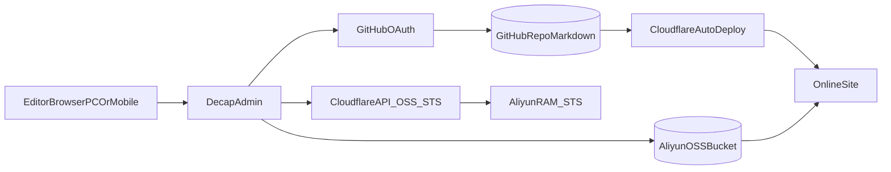

# Decap CMS + OSS(STS) 改造计划

## 目标

- 在不改变现有内容目录（`src/content/blog`）和 Cloudflare 自动部署链路的前提下，新增“类似 WordPress Admin”的发布后台。
- 后台支持：登录、文章新建/编辑/发布、图片上传 OSS 并自动回填 URL、移动端可用。

## 现状确认

- 内容来源是 Markdown/MDX（见 [D:/playground/astrogon/src/content.config.ts](D:/playground/astrogon/src/content.config.ts) 与 [D:/playground/astrogon/src/content/blog/year-2025.md](D:/playground/astrogon/src/content/blog/year-2025.md)）。
- 站点为 Astro + Cloudflare 适配器（见 [D:/playground/astrogon/astro.config.mjs](D:/playground/astrogon/astro.config.mjs)）。
- 当前图片已使用 OSS URL（`wyy-static.oss-cn-guangzhou.aliyuncs.com`）。

## 方案架构

## 实施步骤

1. 新增后台入口与 Decap 配置

- 新增 [D:/playground/astrogon/public/admin/index.html](D:/playground/astrogon/public/admin/index.html)：加载 Decap CMS（可先用官方脚本 CDN）。
- 新增 [D:/playground/astrogon/public/admin/config.yml](D:/playground/astrogon/public/admin/config.yml)：
  - `backend: github`
  - `media_library` 使用自定义 OSS 上传器
  - `collections` 对齐 `blog` schema（`title/description/draft/categories/tags/date/cover` 等）
  - `slug` 规则匹配你当前文件命名习惯（避免 URL 变动）

1. 接入 GitHub OAuth（仅你自己登录）

- 新增 Cloudflare 可用的 OAuth 回调/代理端点（放在 Astro API 路由）。
- 在 Cloudflare 环境变量中配置 `GITHUB_CLIENT_ID`、`GITHUB_CLIENT_SECRET`、`DECAP_OAUTH_SECRET`。
- 在 `config.yml` 中配置对应 `base_url`/`auth_endpoint`，实现 Decap 登录并可直接提交到仓库。

1. 接入阿里云 OSS 安全上传（STS）

- 新增 API 端点：`/api/oss/sts`，返回短时有效上传凭证（禁止下发长期 AK/SK）。
- 新增前端上传适配脚本（例如 [D:/playground/astrogon/public/admin/oss-media-library.js](D:/playground/astrogon/public/admin/oss-media-library.js)）：
  - 选择图片 -> 获取 STS
  - 直传 OSS（按 `xx/yyyy/mm/dd/<uuid>-<name>` 命名）
  - 返回最终 URL 给 Decap，自动写入 markdown/frontmatter
- 约束上传策略：文件类型、大小上限、目录白名单、过期时间。

1. 后台编辑体验优化（PC/手机）

- 使用 Decap 默认 Markdown 编辑器 + 预览，移动端可直接访问 `/admin/`。
- 预置常用 frontmatter 字段（封面、标签、分类、发布日期、草稿状态）。
- 可选：增加常用 Markdown 片段（图片、引用、提示块）按钮或模板。

1. 发布与回归验证

- 登录后台 -> 新建文章 -> 上传图片 -> 发布（Commit）-> 观察 Cloudflare 自动部署 -> 检查线上显示。
- 验证旧文兼容：`cover/published` 与 `image/date` 的兼容逻辑不受影响（见 [D:/playground/astrogon/src/content.config.ts](D:/playground/astrogon/src/content.config.ts)）。

## 上线准备清单

- GitHub OAuth App 回调地址（生产/本地各一套）
- 阿里云 RAM 角色与最小权限策略（仅目标 bucket/prefix 的 PutObject）
- Cloudflare Secrets 注入与环境隔离（preview/prod）
- 管理后台访问控制（至少 GitHub 登录；可追加 IP 白名单或基础鉴权）

## 风险与规避

- OAuth 回调配置不一致导致无法登录：先在本地 + 预发域名分别联调。
- OSS 权限过大：必须用 STS + 最小权限 + 短过期。
- slug/文件名变化导致旧链接失效：在 `config.yml` 固定 slug 生成策略并避免改动历史文件名。

## 交付结果

- 你可通过 PC/手机浏览器访问 `/admin/` 管理文章。
- 图片上传后自动回填 OSS URL，无需手工粘贴。
- 发布动作仍通过 Git 提交触发 Cloudflare 自动构建上线。

